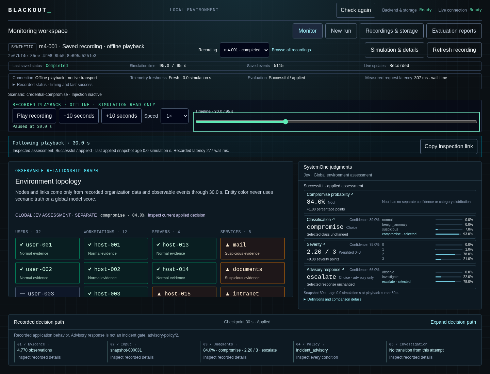

# PROJECT: BLACKOUT

An interactive cybersecurity lab for testing how Jev assesses an unfolding attack.
Launch an attack against a simulated company. Watch Jev's risk assessment change as
evidence arrives. Pause or rewind to inspect the telemetry, model responses, and
decision rules. See what Jev detects and misses.

BLACKOUT runs locally with synthetic telemetry and optional live Jev evaluation.
It supports one active simulation, saved recordings, and offline playback of
actual model responses. It does not ingest real infrastructure telemetry or
contain threats. Its judgments and investigation actions are advisory.

[Quick start](#quick-start) · [Recorded demo](#recorded-demo) ·
[Monitoring guide](docs/MONITORING-WORKSPACE.md) · [Development](#local-development)



Recorded playback at 30 simulation seconds, using the packaged demo's actual Jev
responses. The [monitoring acceptance record](docs/MONITORING-ACCEPTANCE.md)
includes the walkthrough, narrow-screen layout, and measured browser performance.

## What you can do

- **Simulate a company.** Generate authentication, host metrics, DNS, and network
  events for 32 users and 16 hosts. Each run includes 15 minutes of baseline
  history, five rolling evidence windows, and a focus identity selected from
  observed activity.
- **Compare scenarios.** Run baseline traffic, credential compromise, or benign
  maintenance. Smaller credential-attack and harmless-anomaly fixtures remain
  available. Scenario truth stays separate from Jev's input.
- **Inspect model judgments.** View compromise probability, classification,
  severity, and advisory response. Inspect exact inputs, returned distributions,
  timing, and application policies.
- **Follow the evidence.** Select identities, hosts, services, and observed
  connections. Search recorded events by text, entity, type, and time. Trace
  observations through judgments and policy to investigation history.
- **Control and replay runs.** Start or stop scenario activity, pause the
  simulation, change its speed, and seek through saved recordings. Reproduce
  telemetry or request fresh judgments while preserving the original.
- **Save an inspection.** Copy a link that preserves the checkpoint, selected
  judgment, entity, event, and filters. The destination needs the same recording.

The M1–M9 implementation and monitoring dashboard are complete. See the
[release record](docs/M9-RELEASE.md) and
[dashboard acceptance](docs/MONITORING-ACCEPTANCE.md) for scope and verification.

## Quick start

Install Docker with Compose. From the repository root, run:

```bash
docker compose up --build --wait
```

1. Open [localhost:3000](http://localhost:3000).
2. Check that **Backend & storage** and **Live connection** both show **Ready**.
3. Choose **New run**.
4. Enter a seed and duration.
5. Choose a scheduled fixture.
6. Choose **Start run**.

Telemetry-only runs need no API key. To include model judgments, follow
[Evaluate with Jev](#evaluate-with-jev) before starting the run.
The backend health endpoint is
[localhost:3001/api/health](http://localhost:3001/api/health).

The default run lasts 30 simulation seconds and records five baseline events per
second, plus warm-up history. Selecting a full attack or benign control sets the
duration to 95 seconds. These scheduled scenarios inject activity during seconds
5–34 and stop at 35 seconds while baseline traffic continues. Smaller fixtures
inject during seconds 1–8. Runs support durations of 1–120 seconds.
**Completed** appears after the backend saves the final step.

Opening the dashboard selects the linked recording, active run, newest saved
recording, or setup, in that order. Opening or inspecting a recording makes no
model calls. Closing the browser does not stop generation. Starting another run
preserves previous recordings.

```bash
docker compose logs -f  # Follow service logs
docker compose down    # Stop services; retain the database
```

SQLite data lives in the `blackout-data` named volume. Container restarts and
`docker compose down` preserve it. Removing that volume deletes its data.

## Recorded demo

The packaged demo contains actual `jev-1.13.0` responses for baseline,
credential-compromise, and benign-maintenance runs. Playback needs no API key or
internet connection after installation. Building images and installing
dependencies require network access.

Use a separate Compose project to keep existing recordings:

```bash
export BLACKOUT_WEB_PORT=3300 BLACKOUT_API_PORT=3301
docker compose --project-name blackout-demo build
docker compose --project-name blackout-demo run --rm --no-deps server node scripts/install-demo.mjs
docker compose --project-name blackout-demo up --wait
```

1. Open [localhost:3300](http://localhost:3300).
2. Choose **Browse all recordings**.
3. Select the credential-compromise recording.
4. Use **Play recording** or seek to a checkpoint.
5. Select a judgment to inspect its recorded evidence and policy.

Installation verifies the archive checksum and refuses to overwrite an existing
database. If that project already has a database, use its recordings or choose
another project name. Stop the demo with `docker compose --project-name blackout-demo down`.
Its volume remains. Run `unset BLACKOUT_WEB_PORT BLACKOUT_API_PORT` to restore
default ports in the current shell.

See the [demo manifest](demo/manifest.json),
[local Node installation](docs/M9-RELEASE.md#install-the-recorded-demonstration),
and [operator rehearsal](docs/MONITORING-ACCEPTANCE.md#offline-operator-rehearsal).

## Use the monitoring workspace

**Monitor** shows the environment, four **SystemOne judgments** from Jev, and the
**Recorded decision path**. All three views follow the same inspected checkpoint.
Selecting an entity filters its evidence while judgments describe the global
environment. Host inspection includes CPU and memory samples with source events.

**Recorded events** searches all eligible observations through that checkpoint,
including warm-up history. Text, entity, type, and time filters combine. Selecting
an event shows its recorded fields and related entities.

Selecting a historical judgment holds the three views at its checkpoint while
the live simulation continues. **Return to live** restores the current view.
**Copy inspection link** preserves the selected view across refresh and browser
navigation. Existing `?run=…` links still reopen recordings. Links do not transfer
recordings.

**Expand decision path** shows stored policy conditions and investigation
transitions. **Open full inspector** reaches exact questions, state, response,
and timing. The graph shows recorded application behavior, not internal model
reasoning. Entity highlights follow recorded evidence rules, not per-host model
diagnoses.

The health strip shows connection state, telemetry freshness, evaluation state,
and request latency. Inspectors show attempt and decision counts, decisions per
simulation minute, latency summaries, and the latest successful decision's age.
Failed attempts retain the last successful judgment and mark it stale.
Without a successful judgment, risk remains unknown. Responses
received during a simulation pause remain held until application.

### Control a live run

1. Open **New run**.
2. Select **Interactive mode**.
3. Enter a seed and duration.
4. If you want live judgments, enable **Evaluate with Jev**.
5. Choose **Start run**.
6. Open **Simulation & details**.
7. Choose a scenario.
8. Choose **Begin Attack** or **Begin Control**.

**Pause simulation** freezes simulation time and holds new model results.
**Resume simulation** applies held results before continuing.
**Stop Attack** or **Stop Control** ends injection while baseline traffic and
existing evidence remain.

Requested speeds range from 0.25× to 5×. The console shows achieved progress and
inference waits. It never skips evaluation checkpoints. **Reset run** starts the
same seed from zero and retains the previous recording. Reconnect restores
controls after synchronization with the saved state.

### Replay and investigate

Saved playback starts paused. **Play recording**, **Pause playback**, and playback
**Speed** control the client clock. **Recordings & storage** lists saved runs,
newest first. **View active run** returns to ongoing generation.
**Refresh recording** reloads saved events and reconnects active-run updates.

**Simulation & details** contains the **Manifest and command log**, telemetry
rerun, and fresh reevaluation controls for saved runs. A telemetry rerun
reproduces compatible versioned inputs. Fresh reevaluation uses API credits and
saves linked results while preserving the original decisions.

An applied incident advisory opens an **Investigation**. **Acknowledge
investigation** and **Close investigation** record local operator actions.
Investigation actions require the live view or the end of playback.
Falling risk and stopping injection do not close the investigation. The next
matching decision after closure reopens it.

See the [monitoring guide](docs/MONITORING-WORKSPACE.md),
[control timing](docs/M5-CONTROLS.md), and [playback guide](docs/M7-PLAYBACK.md).

## Evaluate with Jev

If `.env` does not exist, create it:

```bash
cp .env.example .env
```

1. Set `JEV_API_KEY` in `.env`.
2. Restart local processes, or run `docker compose up --build --wait` for Compose.
3. Open **New run**.
4. Select **Evaluate with Jev**.
5. Choose **Start run**.

Keep `.env` local. Only the backend uses the key. Request records and the browser
do not contain it. `JEV_MODEL` defaults to the pinned `jev-1.13.0` model.

Jev answers four questions against one observable snapshot:

| Judgment               | Returned value                                      |
| ---------------------- | --------------------------------------------------- |
| Compromise probability | Noul probability                                    |
| Classification         | Choice and its distribution                         |
| Severity               | Weighted Score from 0–3 and its level probabilities |
| Advisory response      | Choice and its distribution                         |

Default checkpoints occur at 0, 5, 10, … simulation seconds and the terminal
snapshot. Each request has a 15-second wall timeout and at most one retry after
one second. The simulation waits until success or a recorded failure. A
30-second run uses 7 requests, at most 14 with retries. A 120-second run uses at
most 50 requests. Setup shows the request budget before starting.

Missing credentials produce **Unavailable** attempts. Missing required fields
make the policy unevaluable. API failures never become low-risk decisions.
Confidence describes distribution concentration, not measured correctness.
Noul has no separate confidence field.

An incident advisory requires all four conditions:

- Compromise probability ≥ 0.8.
- Classification `compromise`.
- Classification confidence ≥ 0.75.
- Severity ≥ 2.

These are provisional application rules, not validated detection thresholds.
The advisory response is not an additional incident gate. The application does
not remediate entities, and declining activity does not establish remediation.
See [Jev evaluation](docs/JEV-EVALUATION.md) and
[investigation policy](docs/M6-CONSOLE.md).

## Model evaluation and results

Live evaluation suites require a running backend with a configured Jev key and
use API credits. The commands print the budget for the backend's configuration.

```bash
npm run evaluate -- --smoke # One 6-second attack run; up to 6 requests
npm run evaluate           # Three seeds × three fixtures; up to 90 requests
npm run evaluate -- --m4 --smoke # One full attack, 20 checkpoints
npm run evaluate -- --m4         # Three seeds × baseline/attack/benign, 180 checkpoints
npm run evaluate -- --m4 --speed=5 # Same suite at checkpoint-preserving 5× requested speed
```

The smaller suite uses `m3-001`, `m3-002`, and `m3-003` across baseline, credential
attack, and harmless anomaly. Each full-suite run lasts 20 simulation seconds.
The M4 suite uses three seeds across baseline, credential compromise, and benign
maintenance. Each run lasts 95 simulation seconds, with injection stopping at
35 seconds. It uses at most 360 requests with default retries.

Each suite retains its runs and saves a report in SQLite and
`data/evaluations/<report-id>.json`. Open **Evaluation reports** to inspect
outcomes. **Refresh reports** reloads the list. Decision links open exact attempts.
Reports retain failures, misses, false incident advisories, classification
changes, suspicion and detection delays, probability changes after injection, token usage,
latency, and achieved speed. Metrics include their denominators.

API failures exit nonzero after saving the report. A model miss remains a
measured outcome. Prior reports remain unchanged. `BLACKOUT_API_URL` selects
another backend. See [metric definitions](docs/JEV-EVALUATION.md) and the
[full-scenario guide](docs/M4-SCENARIOS.md).

The September 17, 2026 [final release suite](docs/evaluations/m9-final-suite.json)
used `jev-1.13.0` across nine synthetic runs:

| Measurement                                      | Recorded result                             |
| ------------------------------------------------ | ------------------------------------------- |
| Valid, policy-evaluable responses                | 180/180                                     |
| Attack runs with incident advisories             | 3/3, each 15 simulation seconds after onset |
| False incident advisories in control checkpoints | 0/123                                       |
| Request latency                                  | 224 ms median, 399 ms p95                   |
| Achieved speed at 5× requested                   | 3.66×–3.85×                                 |

All three attack probabilities remained above 0.2 at 95 seconds: 0.43, 0.37,
and 0.29. These synthetic results do not establish detection effectiveness on
real traffic or calibrated confidence. See the
[release measurements and limitations](docs/M9-RELEASE.md#september-17-2026-release-evidence).

<details>
<summary>Earlier evaluation results</summary>

The September 17, 2026 [M3 follow-up](docs/evaluations/m3-follow-up-suite.json)
returned 45/45 valid responses, with 379 ms median latency and 478 ms p95.
All three attack runs were policy-level misses. The six control runs produced
zero incident advisories across 30 checkpoints.

The September 17, 2026 [M4 suite](docs/evaluations/m4-suite.json) returned 180/180
valid responses. All three attacks produced incident advisories within 15–20
simulation seconds of onset. Control checkpoints produced zero false advisories
across 123 checkpoints. Attack probabilities declined, but none fell below 0.2
after injection stopped. The separate [smoke run](docs/evaluations/m4-smoke.json)
detected only after injection stopped.

</details>

## Local development

Use Node.js 24.21.0 from `.node-version`, npm 11, Python 3, and a C++ build
toolchain for SQLite. See [prerequisites](docs/DEVELOPMENT.md#local-workflow).
Stop Compose before starting local development because both use ports 3000 and 3001.

```bash
npm ci
npm run dev
```

Open [localhost:3000](http://localhost:3000). Use `localhost` to match the
configured browser origin. The page checks the backend, SQLite, and WebSocket
connection. `npm run dev` watches the web app, backend, and shared contracts.

To stop this checkout's frontend, backend, and watchers from another terminal
on Linux:

```bash
npm run dev:stop
```

If you use mise, `mise.toml` selects the pinned Node version:

```bash
mise install
mise exec -- npm ci
mise exec -- npm run dev
```

Local development stores SQLite at `data/blackout.sqlite`, separately from the
Docker volume. Run one backend per database.

### Configuration and checks

Defaults work without an environment file. The root scripts load `.env` when
present. Restart processes after changing it. Compose sets its service
environment in `compose.yaml`.

[.env.example](.env.example) documents the backend address, browser origin,
database path, log level, Jev settings, and policy
thresholds. `BLACKOUT_WEB_PORT` and `BLACKOUT_API_PORT` override Compose host ports.

Keep credentials in server-side configuration. `PUBLIC_BACKEND_URL` is public.
See the [configuration reference](docs/DEVELOPMENT.md#configuration) for defaults.

```bash
npm run check       # Formatting, lint, type checking, unit/integration tests
npm run build       # Build shared contracts, backend, and web app
npx playwright install chromium
npm run test:e2e    # Browser tests against the production build
npm run test:release # Isolated Compose build, demo install and packaged browser rehearsal
```

Vitest covers contracts, generation, persistence, rollback, run isolation,
controls, policy, playback, reruns, and reevaluation immutability. Playwright covers monitoring,
search, inspection links, storage, reconnect, keyboard access, and narrow layouts.
Browser tests use ports 3100/3101 and an in-memory database. Release verification
uses a separate Compose project and disposable volume. GitHub Actions runs the
software checks and packaged release verification.

The September 18, 2026
[dashboard acceptance](docs/MONITORING-ACCEPTANCE.md#final-validation) records 103
passing unit/integration tests, 25 passing Chromium tests, and six packaged
verification groups. Its offline rehearsal inspected 18 checkpoints across
three recordings with zero new model calls or mutations. These recorded results
describe local verification.

After `npm run build`, stop development or Compose before running `npm start`.

## Storage and limits

Recordings survive restart. Unfinished runs become **Interrupted**. M1 recordings
remain readable. **Recordings & storage** shows storage use and offers
**Delete recording** with confirmation. It protects active runs and sources with
linked recordings. Delete linked recordings before their source.

Reset and restart preserve history. Evaluation summaries remain after raw
evidence deletion, with unavailable links labeled. SQLite reuses freed space,
so its file need not shrink. There is no automatic eviction. See
[retention, storage budgets, and recovery](docs/M9-RELEASE.md#retention-and-cleanup).

BLACKOUT loads a complete bounded recording for inspection, with a run limit of
120 simulation seconds. The app has no user authentication or hosted tenancy.
Host ports bind to loopback by default. Targeted keyboard and layout checks do
not constitute a complete accessibility audit.

## Project structure

- **Web:** Next.js App Router, React, TypeScript, Tailwind CSS.
- **Backend:** Fastify, WebSockets, SQLite through `better-sqlite3`.
- **Shared contracts:** Zod schemas and inferred TypeScript types.
- **Checks:** Vitest, Playwright, ESLint, Prettier, GitHub Actions.
- **Workspace:** npm workspaces. One long-running backend owns SQLite.

```text
apps/web/            Next.js console and styles
apps/server/         Fastify backend and SQLite access
packages/contracts/  Shared runtime schemas and TypeScript types
tests/e2e/           Browser tests
demo/                Portable recordings with actual Jev responses
docs/                Product requirements, guides, and acceptance records
```

## Documentation

| Topic                                            | Guide                                                  |
| ------------------------------------------------ | ------------------------------------------------------ |
| Monitoring, search, inspection links, and health | [Monitoring workspace](docs/MONITORING-WORKSPACE.md)   |
| Dashboard acceptance and performance             | [Monitoring acceptance](docs/MONITORING-ACCEPTANCE.md) |
| Telemetry, rolling windows, and observable state | [State rules](docs/OBSERVABLE-STATE.md)                |
| Model requests, policies, and metrics            | [Jev evaluation](docs/JEV-EVALUATION.md)               |
| Attack stages and benign controls                | [Scenarios](docs/M4-SCENARIOS.md)                      |
| Simulation controls and timing                   | [Controls](docs/M5-CONTROLS.md)                        |
| Decision inspection and investigation history    | [Decision console](docs/M6-CONSOLE.md)                 |
| Playback, seeking, reruns, and reevaluation      | [Playback](docs/M7-PLAYBACK.md)                        |
| Entity evidence and environment topology         | [Topology](docs/M8-TOPOLOGY.md)                        |
| Demo installation, measurements, and recovery    | [Release guide](docs/M9-RELEASE.md)                    |
| Development, configuration, and APIs             | [Development guide](docs/DEVELOPMENT.md)               |
| Requirements and reviewed decisions              | [Product requirements](docs/PRD.md)                    |
| Milestones M1–M9 and acceptance criteria         | [MVP roadmap](docs/MVP-ROADMAP.md)                     |
| Published GitHub tickets and dependencies        | [MVP tickets](docs/MVP-TICKETS.md)                     |
| Architecture assessment                          | [Codebase evaluation](docs/CODEBASE-EVALUATION.md)     |
